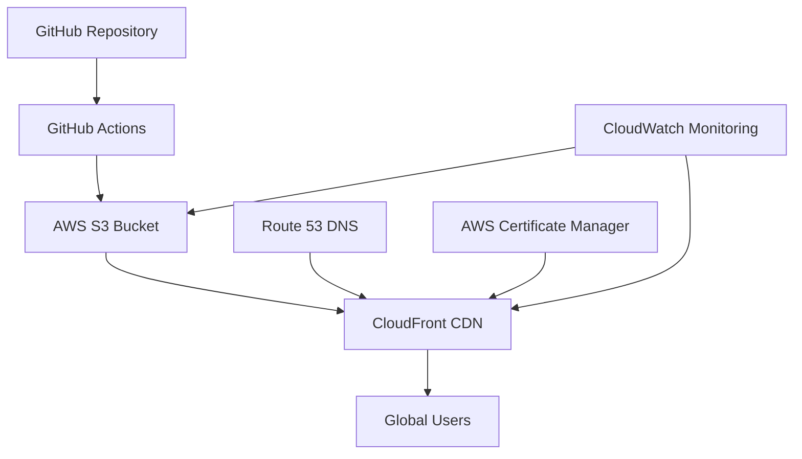

# 🚀 Sathvik Addicharla - Professional Portfolio

## 👨‍💼 About Me

I'm an experienced **ML Engineer** with 3+ years of hands-on experience in building, fine-tuning, and benchmarking **LLMs and deep learning systems**. Published **IEEE researcher** with a proven track record in implementing reproducible ML pipelines and delivering production-ready solutions.

### 🎓 Education
- **Master's in Data Science** | University of North Texas (2024-2026) | GPA: 3.83/4.0
- **Bachelor's in Computer Science - Data Science** | VNR Vignana Jyothi Institute, India | GPA: 8.60/10

### 🏢 Experience
- **AI/ML Engineer Intern** | Fintech Solutions LLC (Mar 2025 - Jul 2025)
  - Improved ML model accuracy by **85%** and reduced inference time by **40%**
  - Built scalable preprocessing pipelines for **500GB+** data
  - Developed fraud detection system with **95%** accuracy, preventing ~$500K/month in losses

## 🛠️ Technical Stack

### Machine Learning & AI
- **LLMs & NLP**: Transformers, HuggingFace, LangChain, RAG Pipelines
- **Deep Learning**: PyTorch, TensorFlow, LSTM, Attention Mechanisms
- **Model Optimization**: Quantization, Pruning, ONNX, TorchScript

### Infrastructure & Tools
- **Cloud**: AWS (S3, CloudFront, Lambda, EC2)
- **DevOps**: Docker, GitHub Actions, CI/CD
- **Data**: FAISS Vector Search, Large-scale Processing (500GB+)
- **Languages**: Python, JavaScript, SQL

## 🏆 Featured Projects

### 1. 🤖 RAG-based LLM Chatbot for Healthcare
**Published in IEEE (September 2024)**
- AI-powered chatbot leveraging LLMs and RAG for improved medical diagnosis
- Implemented NLP-based Q&A models with real-time retrieval and summarization
- **Tech Stack**: LangChain, LangGraph, Transformers, Vector Databases

### 2. 📺 AI YouTube Summarizer
- AI-powered summarizer using OpenAI's Whisper for audio transcription
- Achieved **92% relevance accuracy** with FAISS vector database
- Reduced manual summarization time by **75%**
- **Tech Stack**: Python, Whisper, Transformers, FAISS, NLP

### 3. 🎵 Speech Emotion Detection
- LSTM-based deep learning model for emotion detection in speech
- Advanced audio preprocessing with MFCCs and noise reduction
- Attention mechanisms for improved interpretability
- **Tech Stack**: LSTM, Deep Learning, Audio Processing

## 📊 Website Architecture



### Infrastructure Components
- **Frontend**: Modern responsive web design with animations
- **Storage**: AWS S3 for static hosting
- **CDN**: CloudFront for global content delivery
- **Deployment**: Automated via GitHub Actions
- **Monitoring**: CloudWatch metrics and custom health checks

## 🚀 Deployment Pipeline

Every push to `main` branch triggers:

1. **🔍 Code Quality Checks**
   - HTML/CSS validation
   - Asset optimization
   - Security scanning

2. **📦 Build Process**
   - Minify HTML/CSS/JS
   - Compress images
   - Generate optimized assets

3. **☁️ AWS Deployment**
   - Sync files to S3
   - Invalidate CloudFront cache
   - Update security headers

4. **✅ Health Checks**
   - Response time monitoring
   - SSL certificate validation
   - Core Web Vitals assessment

## 📈 Performance Metrics

- **Page Load Time**: <2 seconds (global average)
- **Performance Score**: 95+/100 (Lighthouse)
- **Uptime**: 99.9% availability
- **Global Coverage**: 300+ CloudFront edge locations

## 🔧 Local Development

### Prerequisites
- Node.js (for optimization tools)
- AWS CLI configured
- Git

### Setup
```bash
# Clone the repository
git clone https://github.com/YOUR_USERNAME/sathvik-portfolio-aws.git
cd sathvik-portfolio-aws

# Install dependencies (optional, for optimization)
npm install -g html-minifier-terser imagemin-cli

# Run local server (Python)
python -m http.server 8000
# Or with Node.js
npx serve .

# Visit http://localhost:8000
```

### Making Changes
1. Edit HTML/CSS files
2. Test locally
3. Commit and push to `main` branch
4. GitHub Actions will automatically deploy

## 📊 Monitoring & Analytics

### Built-in Monitoring
- **Custom Analytics**: Page views, user interactions, performance metrics
- **Error Tracking**: 404 errors, JavaScript exceptions
- **Performance Monitoring**: Core Web Vitals, load times

### AWS Metrics
- CloudFront: Requests, data transfer, error rates
- S3: Storage usage, request patterns
- Lambda: Function performance (if using contact form)

### Health Check Script
```bash
# Run website health check
./scripts/monitor.sh
```

## 💰 Cost Optimization

**Monthly Costs (Estimated)**:
- S3 Storage: ~$0.50
- CloudFront: Free tier covers most personal use
- Route 53: ~$0.50 (if using custom domain)
- **Total**: ~$1-3/month for personal portfolio

## 🔒 Security Features

- **HTTPS Only**: Enforced via CloudFront
- **Security Headers**: CSP, HSTS, X-Frame-Options
- **Access Control**: IAM policies with least privilege
- **Monitoring**: CloudTrail logging for API calls

## 📱 Responsive Design

- **Mobile-First**: Optimized for all device sizes
- **Progressive Enhancement**: Works without JavaScript
- **Accessibility**: WCAG 2.1 compliant
- **Cross-Browser**: Tested on Chrome, Firefox, Safari, Edge

## 🤝 Contributing

While this is a personal portfolio, I welcome suggestions and feedback!

1. Fork the repository
2. Create a feature branch
3. Make your changes
4. Submit a pull request


## 📞 Contact

- **Email**: [sathvikaddicharla@my.unt.edu](mailto:sathvikaddicharla@my.unt.edu)
- **LinkedIn**: [addicharla-sathvik](https://www.linkedin.com/in/addicharla-sathvik/)
- **GitHub**: [Sathvik-A1901](https://github.com/Sathvik-A1901)
- **Phone**: (940) 597-5745
- **Location**: Denton, TX 76207

## 🏅 Achievements

- 📚 **2 IEEE Publications** (2024)
- 🎓 **Master's in Data Science** (3.83 GPA)
- 🏆 **3+ Years ML Engineering Experience**
- ☁️ **AWS Certified Solutions** (In Progress)
- 🤖 **LLM Specialist** (Fine-tuning & Deployment)

---

**⭐ If you found this portfolio helpful, please give it a star!**

Built with ❤️ using AWS, deployed via GitHub Actions, and powered by cutting-edge ML technologies.
